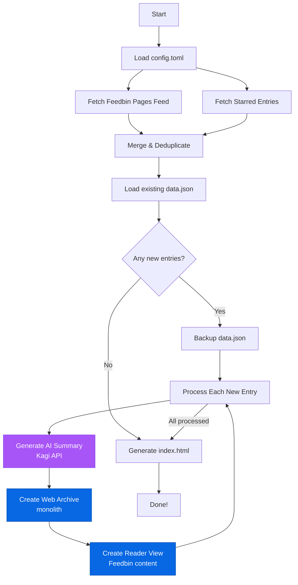

# Breadcrumbs: A local archive of your pages and stars from Feedbin 🍔

A Python tool to archive your Feedbin starred articles and Pages feed entries with automatic AI-powered summaries using Kagi's Universal Summarizer.

![Screenshot showing the Breadcrumbs web interface with a dark theme displaying a search bar at the top, filter buttons for All, Pages, and Stars below it, and a list of archived articles with titles, URLs, publication dates, and expandable summaries. Each entry shows both Feedbin summaries with hamburger icons and AI-generated TL;DR summaries with sparkle icons, along with links to reader view and web archive versions. The interface has a clean, modern design with purple accent colors and maintains the familiar Feedbin aesthetic](./screenshot.jpeg)

## Features

- Fetches entries from your Feedbin "Pages" feed and starred articles
- **Dual summary system**:
  - 🍔 Feedbin's original summaries from the RSS feed
  - ✨ AI-generated TL;DR using Kagi's Universal Summarizer API
- **Dual archiving system**:
  - 📖 Reader View archives from Feedbin's extracted content (clean, reader-friendly HTML)
  - 🗃️ Web archives using monolith (complete page with all resources, no video/audio/JS)
- **Beautiful web interface** - Browse and search your entries with a Feedbin-inspired dark theme
- Merges new entries with existing data while preserving history
- Automatically backs up data with timestamps before updates
- Outputs structured JSON with entry metadata and summaries
- Simple TOML configuration (just output directory and log level)

## Setup

### 1. Install dependencies

This project uses [uv](https://github.com/astral-sh/uv) for dependency management:

```bash
uv sync
```

You'll also need [monolith](https://github.com/Y2Z/monolith) installed for archiving web pages:

```bash
# macOS
brew install monolith

# Linux (cargo)
cargo install monolith

# Or download pre-built binaries from GitHub releases
```

### 2. Set environment variables

```bash
export FEEDBIN_EMAIL='your-email@example.com'
export FEEDBIN_PASSWORD='your-password'
export KAGI_API_KEY='your-kagi-api-key'
```

Note: If `KAGI_API_KEY` is not set, the script will still run but won't generate AI TL;DR summaries (Feedbin summaries will still be available).

### 3. Configure (optional)

On first run, a `config.toml` file will be created automatically with defaults:

```toml
output_dir = "./dist"
log_level = "INFO"
```

You can customize:
- **`output_dir`**: Where to store data (default: `./dist`)
- **`log_level`**: Logging verbosity - `"DEBUG"`, `"INFO"` (default), `"WARNING"`, `"ERROR"`, or `"CRITICAL"`

## Usage

Run the script:

```bash
uv run python breadcrumbs.py
```

### How It Works



The script will:
1. Load configuration from `config.toml`
2. Fetch all entries from your Feedbin "Pages" feed
3. Fetch all your starred articles
4. Merge entries (marking duplicates appropriately)
5. For each new entry:
   - Generate AI summary via Kagi API (if API key provided)
   - Archive the full web page using monolith
   - Create a content archive from Feedbin's extracted content
6. Save to `dist/data/data.json` with backup of previous version
7. Generate a beautiful HTML interface at `dist/index.html`

### Viewing Your Entries

Open `dist/index.html` in your browser to access the web interface:

```bash
open dist/index.html
```

The interface includes:
- **Real-time search** - Filter entries by title, URL, or summary
- **Type filters** - View all entries, just pages (📄), or just starred (⭐)
- **Dual summaries** - 🍔 Feedbin summaries and ✨ AI TL;DR with distinct gradients
- **Expandable summaries** - Long summaries collapse to 3 lines with a "Show more +" button
- **Quick access** - Links to original URLs, reader view (📖), and web archives (🗃️)
- **Responsive design** - Works great on desktop and mobile
- **Keyboard shortcuts** - Press Cmd/Ctrl + K to focus search

## Output Structure

Data is saved in `dist/data/data.json`:

```json
{
  "generated_at": "2024-01-15T10:30:00.123456",
  "entries": [
    {
      "id": 12345,
      "title": "Article Title",
      "url": "https://example.com/article",
      "published": "2024-01-15T08:00:00.000000Z",
      "created_at": "2024-01-15T08:05:00.000000Z",
      "entry_type": "page",
      "content": "Feedbin-extracted article content (HTML)...",
      "summary": "Original summary from the RSS feed...",
      "tldr": "AI-generated TL;DR from Kagi...",
      "archive_file": "archive/12345_example.com_article.html",
      "content_archive_file": "archive/content-12345_example.com_article.html"
    }
  ]
}
```

### Entry Types

- **`page`**: Entry from your "Pages" feed
- **`star`**: Starred entry (or starred entry that's also in Pages feed)

### Archive Files

Breadcrumbs creates two types of archives for each entry:

#### 1. Content Archives (Recommended for Reading)
Generated from Feedbin's extracted content field:
- Stored in `dist/archive/` directory
- Filename format: `content-{entry_id}_{url_slug}.html`
- Clean, reader-friendly HTML with article content
- Styled with the same Feedbin-inspired dark theme as the main interface
- Fast to load and easy to read
- The `content_archive_file` field contains the relative path (e.g., `archive/content-12345_example.com_article.html`)

#### 2. Web Archives (Full Page Preservation)
Generated using [monolith](https://github.com/Y2Z/monolith):
- Stored in `dist/archive/` directory
- Filename format: `{entry_id}_{url_slug}.html`
- Complete web page with all CSS, images, and resources embedded inline
- Preserves the exact look of the original page
- Larger file sizes due to embedded resources
- The `archive_file` field contains the relative path (e.g., `archive/12345_example.com_article.html`)

## Directory Structure

```
.
├── config.toml          # Configuration file
├── breadcrumbs.py       # Main script
├── templates/
│   ├── index.html       # Jinja2 template for web interface
│   └── entry.html       # Jinja2 template for content archives
├── dist/
│   ├── index.html       # Generated web interface
│   ├── data/
│   │   ├── data.json              # Current data
│   │   └── data-YYYYMMDD-HHMMSS.json  # Timestamped backups
│   ├── archive/
│   │   ├── content-{entry_id}_{url_slug}.html  # Content archives (Feedbin extracted)
│   │   └── {entry_id}_{url_slug}.html          # Full page archives (monolith)
│   └── logs/
│       └── breadcrumbs-YYYYMMDD-HHMMSS.log  # Execution logs
```

## Tools & APIs Used

- [Feedbin API v2](https://github.com/feedbin/feedbin-api) - RSS feed management
- [Kagi Universal Summarizer API](https://help.kagi.com/kagi/api/summarizer.html) - AI-powered summarization
- [monolith](https://github.com/Y2Z/monolith) - Web page archiving with embedded resources

## Requirements

- Python 3.14+
- [monolith](https://github.com/Y2Z/monolith) - Command-line tool for archiving web pages
- Dependencies managed via `pyproject.toml` (installed with `uv sync`)

## Credits

Created by [Justin Pecott](https://github.com/justinpecott) with significant contributions from [Claude Code (Anthropic)](https://www.claude.com/product/claude-code). The beautiful web interface, archiving functionality, and overall architecture were developed collaboratively through an iterative design process.

Special thanks to:
- [Feedbin](https://feedbin.com) for the excellent RSS reader that inspired this tool
- [Kagi](https://kagi.com) for the Universal Summarizer API
- The creators of [monolith](https://github.com/Y2Z/monolith) for the web archiving tool
